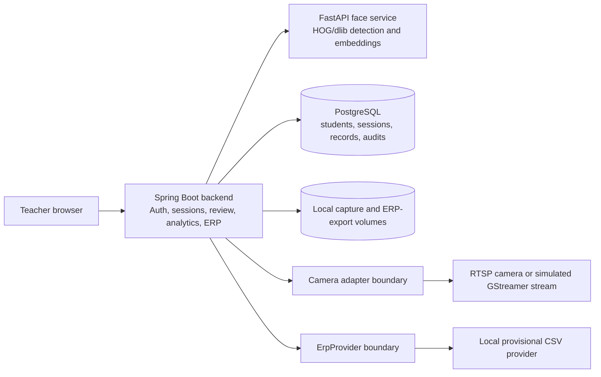

# ClassSight architecture

The Spring service owns authentication, authorization, enrollment orchestration, capture persistence, attendance records, manual review, analytics/PDF reporting, ERP synchronization, and camera health state. The FastAPI service performs image detection and embedding comparison. PostgreSQL persists business state. Raw captures and provisional ERP exports use local bind-mounted filesystem paths. The camera adapter currently uses FFmpeg to obtain one RTSP frame and is intentionally separated from browser capture. The ERP provider boundary allows a future real integration without coupling core attendance logic to a vendor.
